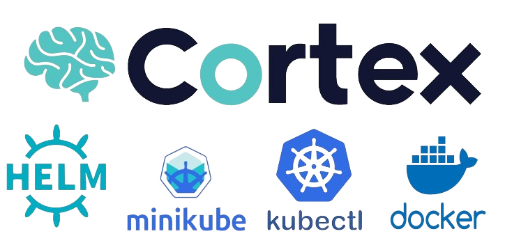

# Cortex Deployment on Minikube

This guide will walk you through deploying the Cortex analysis platform along with Elasticsearch on a local single node Minikube cluster.

## Prerequisites

Before starting, ensure you have the following tools installed on your system:

For a smooth operation of Cortex and Elasticsearch on Minikube, the following minimum system resources are recommended:

- **CPU**: At least 2 CPU cores available available to assign to the Minikube cluste.
- **Memory**: At least 4 GB of RAM available to assign to the Minikube cluster.
- **Disk Space**: At least 30 GB of free disk space for the Minikube cluster.

### Package dependencies

- **Minikube**: [Installation Guide](https://minikube.sigs.k8s.io/docs/start/)
  - We will use the Docker driver, but other [Drivers](https://minikube.sigs.k8s.io/docs/drivers/) are also supported.
- **Kubectl**: [Installation Guide for Linux](https://kubernetes.io/docs/tasks/tools/install-kubectl-linux/)
- **Docker**: [Installation Guide](https://docs.docker.com/engine/install/)
- **Helm**: [Installation Guide](https://helm.sh/docs/intro/install/)

## Automated Prerequisites Installation (Ubuntu/Debian)

To automate the installation of the prerequisites, you can use the provided script. Remember to review scripts before executing them:

Change the working directory to the repository:

```bash
cd cortex-on-minikube
```

Execute the automated installation script:

```bash
sudo ./install_dependencies.sh
```

## Manual Installation Steps (Ubuntu/Debian)

If you prefer manual installation or have not used the automated script, follow these steps:

### Installing Kubectl:

```bash
curl -LO "https://dl.k8s.io/release/$(curl -L -s https://dl.k8s.io/release/stable.txt)/bin/linux/amd64/kubectl"
sudo install -o root -g root -m 0755 kubectl /usr/local/bin/kubectl && rm kubectl
```

### Installing Minikube:

```bash
curl -LO https://storage.googleapis.com/minikube/releases/latest/minikube-linux-amd64
sudo install minikube-linux-amd64 /usr/local/bin/minikube && rm minikube-linux-amd64
```

### Installing Docker:

```bash

# Uninstall old conflicting packages
for pkg in docker.io docker-doc docker-compose docker-compose-v2 podman-docker containerd runc; do sudo apt-get remove $pkg; done

# Add Docker's official GPG key
sudo apt-get update
sudo apt-get install ca-certificates curl
sudo install -m 0755 -d /etc/apt/keyrings
sudo curl -fsSL https://download.docker.com/linux/ubuntu/gpg -o /etc/apt/keyrings/docker.asc
sudo chmod a+r /etc/apt/keyrings/docker.asc

# Add the repository to Apt sources
echo \
  "deb [arch=$(dpkg --print-architecture) signed-by=/etc/apt/keyrings/docker.asc] https://download.docker.com/linux/ubuntu \
  $(. /etc/os-release && echo "$VERSION_CODENAME") stable" | \
  sudo tee /etc/apt/sources.list.d/docker.list > /dev/null
sudo apt-get update

# Install the latest docker version
sudo apt-get install -y docker-ce docker-ce-cli containerd.io docker-buildx-plugin docker-compose-plugin
```

### Installing Helm:

```bash
curl -LO https://get.helm.sh/helm-v3.14.4-linux-amd64.tar.gz
tar -zxvf helm-v3.14.4-linux-amd64.tar.gz
sudo mv linux-amd64/helm /usr/local/bin/helm

# Cleanup the downloaded files
rm -rf linux-amd64 helm-v3.14.4-linux-amd64.tar.gz
```

## Getting Started

### Start Minikube

Start your Minikube cluster using Docker as the driver and allocate sufficient resources:

```bash
minikube start --driver=docker --cpus 2 --memory 4096 --addons=ingress
```

You may have an error regarding the user permission to use Docker when running this command, this is solved by running the command:

```bash
sudo usermod -aG docker $USER && newgrp docker
```

Then you will need to run the minikube start command again.

### Deploying Cortex

#### Deploying Prometheus and Grafana for monitoring (Optional)

If you want to deploy the monitoring services Prometheus and Grafana you will need to set the variable monitoring.enabled to true in the cortex-chart/values.yaml file before deploying the Cortex chart. It should look like this:

```yaml
monitoring:
  enabled: true # Set to true if you want to deploy Prometheus and Grafana
```

#### Deploying the Cortex chart

To deploy the Cortex chart you will first need to build the Helm dependencies:

```bash
helm dependency build cortex-chart
```

Then deploy the Cortex Platform by running:

```bash
helm install cortex cortex-chart
```

Check the deployment in the namespace cortex, it can take around 2 to 3 minutes to be fully deployed:

```bash
kubectl get all -n cortex
```

### Accessing Cortex

After ensuring that all the elements are fully deployed, access Cortex using the following steps:

Get the Cortex status by running:

```bash
curl "http://$(minikube ip)/api/status"
```

For direct browser access, navigate to ```http://<minikube-ip>``` in your web browser.

You can get the minikube ip by running this command:

```bash
minikube ip
```

### Accessing Grafana

For browser access, navigate to ```http://<minikube-ip>:3000``` in your web browser.

Default credentials:

**username**: admin
***password***: admin

Go to Dashboards to view monitoring stats

### Kubectl Port Forwarding for Cortex (Optional)

If you are accessing from a different machine, you can set up a Kubectl port forwarding to be able to access from the exterior:

```bash
sudo kubectl port-forward --kubeconfig=/home/$USER/.kube/config -n ingress-nginx --address 0.0.0.0 services/ingress-nginx-controller 80:80
```

Navigate to ```http://<machine-ip>``` in your web browser to access the Cortex platform.

For further steps in the configuration process of Cortex you can follow the official documentation: [First Start](https://docs.strangebee.com/cortex/user-guides/first-start/)

### Kubectl Port Forwarding for Grafana (Optional)

```bash
sudo kubectl port-forward --kubeconfig=/home/$USER/.kube/config -n default --address 0.0.0.0 service/cortex-grafana 3000:80
```

Navigate to ```http://<machine-ip>:3000``` in your web browser to access Grafana.

Default credentials:

**username**: admin
***password***: admin

Go to Dashboards to view monitoring stats

## Uninstalling

### Uninstall Cortex deployment

To remove the Cortex deployment from your Minikube cluster, use the following Helm command:

```bash
helm uninstall cortex
```

### Stop Minikube

Once you have uninstalled the deployment, you can stop Minikube:

```bash
minikube stop
```

### Remove Dependencies (Optional)

If you want to remove all installed dependencies (Docker, Kubectl, Helm, and Minikube), you can run the provided script. Remember to carefully review each script before executing to ensure it performs actions that are safe and intended for your environment.

```bash
sudo ./remove_dependencies.sh
```
